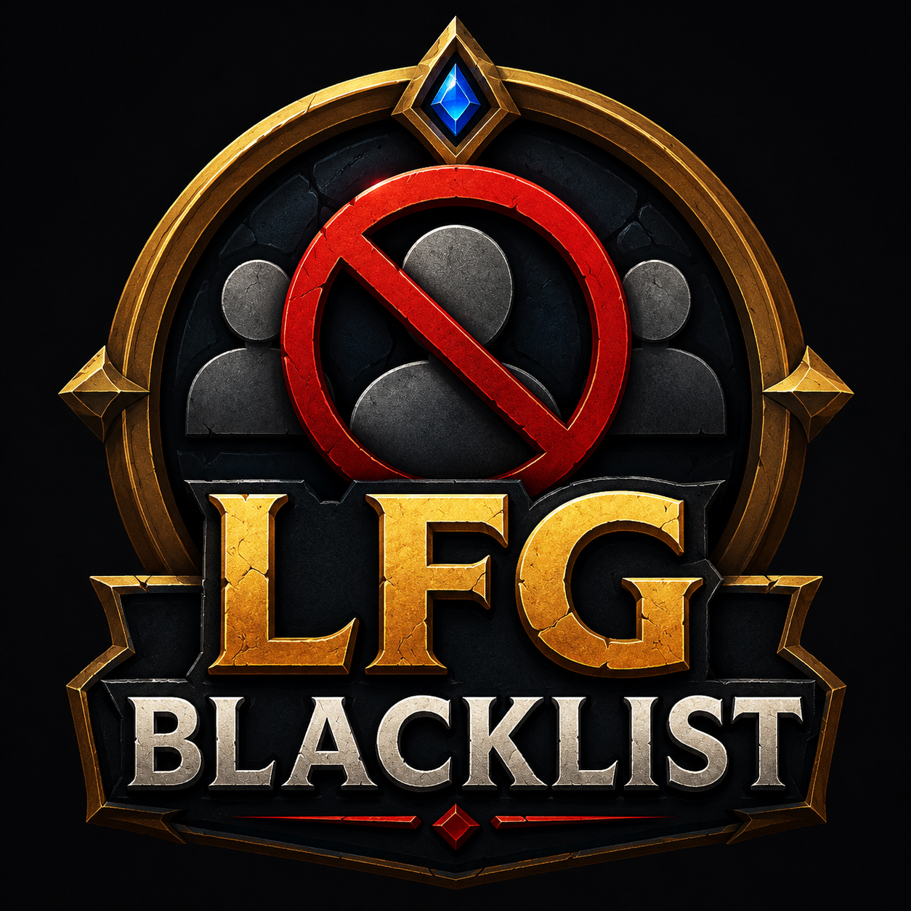

<p align="center">
  
</p>

<h1 align="center">LFG Blacklist</h1>

<p align="center">
  Blacklist toxic players and highlight them in World of Warcraft Premade Group Finder.
  <br/>
  Designed for Mythic+, raids, and WoW Retail <strong>Midnight 12.0.5+</strong>.
  <br/><br/>
  <a href="Roadmap.md">Roadmap</a> •
  <a href="CHANGELOG.md">Changelog</a> •
  <a href="LICENSE">License</a>
</p>

---

## Features

### Blacklist Players
Maintain a personal blacklist with configurable reasons:
- Leaver, Toxic, Bad Player, Ninja Pull, Boost Spam, and more
- Notes and timestamps per player
- Names stored as `name-realm` — works cross-realm

### LFG Highlighting
- Highlights blacklisted **group leaders** in the Search panel
- Highlights blacklisted **applicants** in your own ApplicationViewer
- Chat notification when a blacklisted player applies to your group
- Tooltip warning when hovering over a blacklisted player

### Right-Click Integration
Blacklist players directly from:
- Target frame
- Party frame
- Raid frame

```
Right Click → LFG Blacklist → Add to blacklist → Leaver
```

### Config UI
Movable config window with three tabs:
- **Blacklist** — view and remove blacklisted players
- **Reasons** — manage custom reason labels
- **Settings** — toggle highlight, tooltip, popup menu

---

## Slash Commands

| Command | Description |
|---|---|
| `/lfgbl` | Open config |
| `/lfgbl add Name-Realm` | Add player to blacklist |
| `/lfgbl remove Name-Realm` | Remove player |
| `/lfgbl check Name-Realm` | Check if blacklisted |
| `/lfgbl debug` | Print debug info to chat |

---

## Installation

### Manual
1. Download the latest release
2. Extract `LFGBlacklist` into your `World of Warcraft/_retail_/Interface/AddOns/` folder
3. Reload UI

### CurseForge / Wago
Search for **LFG Blacklist** and install via your preferred addon manager.

---

## Requirements

- WoW Retail — Midnight **12.0.5+**
- No external dependencies

---

## License

MIT — see [LICENSE](LICENSE)